#轻松学会Laravel-表单篇

###Controller之Request
StudentController.php
```
<?php

namespace App\Http\Controllers;

use Illuminate\Support\Facades\DB;
use Illuminate\Http\Request;
use App\Student;

class StudentController extends Controller
{
	public function index(Request $request){
    	// 取值
		echo $request->input('name', '默认值');
	}
}
```
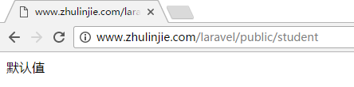
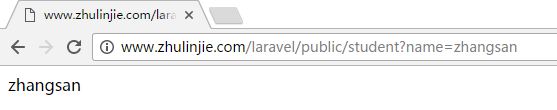

StudentController.php
```
<?php

namespace App\Http\Controllers;

use Illuminate\Support\Facades\DB;
use Illuminate\Http\Request;
use App\Student;

class StudentController extends Controller
{
	public function index(Request $request){
    	// 取值
		if($request->has('name')){
			echo $request->input('name');
		}else{
			echo '参数不存在';
		}
	}
}
```
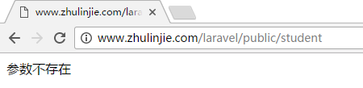
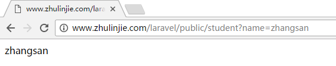

StudentController.php
```
<?php

namespace App\Http\Controllers;

use Illuminate\Support\Facades\DB;
use Illuminate\Http\Request;
use App\Student;

class StudentController extends Controller
{
	public function index(Request $request){
		// 判断请求类型
		echo $request->method();

		echo '<br />';

		if($request->isMethod('GET')){
			echo 'Yes';
		}else{
			echo 'No';
		}

		echo '<br />';

		// 判断是否是Ajax请求
		if($request->ajax()){
			echo 'Yes';
		}else{
			echo 'No';
		}

		echo '<br />';

		// 判断请求的url是否符合特定的格式
		if($request->is('student')){
			echo 'Yes';
		}else{
			echo 'No';
		}

		echo '<br />';

		if($request->is('student/*')){
			echo 'Yes';
		}else{
			echo 'No';
		}

		echo '<br />';

		// 获取当前的url
		echo $request->url();
	}
}
```
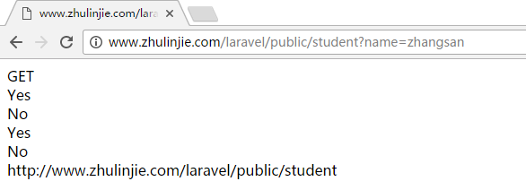

###Controller之Session
`config/session.php` session配置文件  

app/Http/Kernel.php

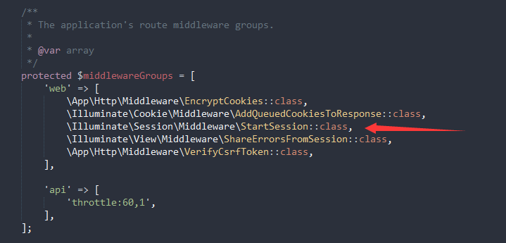

routes.php
```
Route::group(['middleware' => ['web']], function () {
    Route::get('student', [
    	'uses' => 'StudentController@index',
    	'as' => 'student'
    ]);
});
```

StudentController.php
```
<?php

namespace App\Http\Controllers;

use Illuminate\Http\Request;
use App\Student;
use Session;

class StudentController extends Controller
{
	public function index(Request $request){
		// HTTP request session()
		$request->session()->put('name', 'zhangsan');
		echo $request->session()->get('name');
		echo '<br />';

		// session()
		session()->put('email', 'zhulinjie_cool@126.com');
		echo session()->get('email');
		echo '<br />';

		// Session
		Session::put('address', 'beijing');
		echo Session::get('address');
		echo '<br />';

		// 不存在取默认值
		echo Session::get('location', 'beijing chaoyang');
		echo '<br />';

		// 以数组的形式存储数据
		Session::put(['key1'=>'value1']);
		echo Session::get('key1', 'default');

		// 把数据存放到Session的数组中
		Session::push('arr1', 'value1');
		Session::push('arr1', 'value2');
		$res = Session::get('arr1');
		echo '<pre>';
		print_r($res);
		echo '<br />';

		// 取出数据并删除
		Session::put('key2', 'value2');
		echo Session::pull('key2', 'default');
		echo '<br />';
		echo Session::pull('key2', 'default');

		// 获取session所有的数据
		// $res = Session::all();
		// echo '<pre>';
		// print_r($res);
		echo '<br />';
		
		// 判断session中某个key是否存在
		if(Session::has('key1')){
			echo 'Yes';
		}else{
			echo 'No';
		}
		echo '<br />';

		// 暂存数据
		Session::flash('key3', 'value3');
		echo Session::get('key3');
		echo '<br />';

		// 删除session中指定的key的值
		// Session::forget('key1');

		// 清空所有session信息
		Session::flush();
	}
}
```
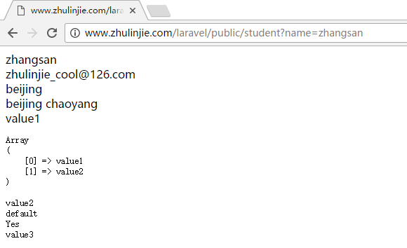

###Controller之Response
routes.php
```
Route::group(['middleware' => ['web']], function () {
    Route::get('student', ['uses' => 'StudentController@index', 'as' => 'student']);
    Route::get('response', ['uses' => 'StudentController@response', 'as' => 'response']);
});
```

StudentController.php
```
<?php

namespace App\Http\Controllers;

use Illuminate\Http\Request;
use App\Student;
use Session;

class StudentController extends Controller
{
	public function index(Request $request){
		// 响应的常见类型		1、字符串	2、视图		3、Json		4、重定向

		// 响应json
		// $data = [
		// 	'errCode' => 0,
		// 	'errMsg' => 'success',
		// 	'data' => 'zhangsan'
		// ];
		// return response()->json($data);
		
		// 重定向 with原理同session()->flash() 
		// return redirect('response')->with('message', '我是快闪数据');
		// return redirect()->action('StudentController@response')->with('message', '我是快闪数据');
		return redirect()->route('response')->with('message', '我是快闪数据');

		// 返回上一个页面
		// return redirect()->back();
	}

	public function response(){
		echo Session::get('message', 'default');
	}
}
```
访问：http://www.zhulinjie.com/laravel/public/student  

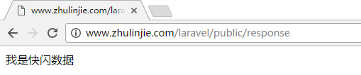  

再次访问：http://www.zhulinjie.com/laravel/public/student

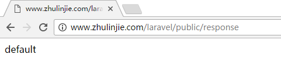

###Controller之Middleware
routes.php
```
// 宣传阶段
Route::get('student', ['uses' => 'StudentController@index', 'as' => 'student']);

// 活动进行阶段
Route::group(['middleware' => ['activity']], function () {
    Route::get('response', ['uses' => 'StudentController@response', 'as' => 'response']);
});
```

StudentController.php
```
<?php

namespace App\Http\Controllers;

use Illuminate\Http\Request;
use App\Student;
use Session;

class StudentController extends Controller
{
	public function index(Request $request){
		echo '活动还未开始...';
	}

	public function response(){
		echo '活动正在进行中...';
	}
}
```

Activity.php
```
<?php

namespace App\Http\Middleware;

use Closure;

class Activity{
	// 前置写法
	public function handle($request, Closure $next){
		if(time() < strtotime('2017-01-04')){
			return redirect('student');
		}
		return $next($request);
	}
}
```

Kernel.php
```
protected $routeMiddleware = [
    'auth' => \App\Http\Middleware\Authenticate::class,
    ...
    'activity' => \App\Http\Middleware\Activity::class
];
```

访问：http://www.zhulinjie.com/laravel/public/response

2017-01-04日之前访问

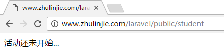

2017-01-04日之后访问

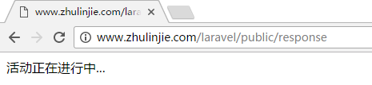