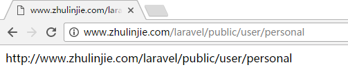

#轻松学会Laravel-基础篇

######Laravel 一键安装包下载：[http://www.golaravel.com/download/](http://www.golaravel.com/download/)

###路由参数
```
Route::get('user/{id}', function($id){
	return $id;
});
```
符合条件的路由：http://www.zhulinjie.com/laravel/public/user/1


```
Route::get('user/{name?}', function($name='zhangsan'){
	return $name;
});
```
不传参数访问： http://www.zhulinjie.com/laravel/public/user

  

传参数访问：http://www.zhulinjie.com/laravel/public/user/zhulinjie


```
Route::get('user/{name?}', function($name='zhangsan'){
	return $name;
})->where('name', '[A-Za-z]+');
```
符合条件的路由：http://www.zhulinjie.com/laravel/public/user/zhangsan

  

不符合条件的路由：http://www.zhulinjie.com/laravel/public/user/1


###别名路由
```
Route::get('user/user-personal', ['as'=>'personal', function(){
	return route('personal');
}]);
```
符合条件的路由：http://www.zhulinjie.com/laravel/public/user/zhangsan


###路由群组
```
Route::group(['prefix'=>'admin'], function(){
	Route::get('user/user-personal', ['as'=>'personal', function(){
		return route('personal');
	}]);
});
```
符合条件的路由：http://www.zhulinjie.com/laravel/public/admin/user/user-personal


###控制器
routes.php
```
Route::get('user/personal', [
	'uses' => 'PersonalController@index',
	'as' => 'personal'
]);
```
PersonalController.php
```
<?php

namespace App\Http\Controllers;

class PersonalController extends Controller
{
	public function index(){
		return route('personal');
	}
}
```


###模型
Personal.php
```
<?php

namespace App;

use Illuminate\Database\Eloquent\Model;

class Personal extends Model{
	public static function getAll(){
		return 'data';
	}
}
```
PersonalController.php
```
<?php

namespace App\Http\Controllers;

use App\Personal;

class PersonalController extends Controller
{
	public function index(){
		return Personal::getAll();
	}
}
```


###使用DB facade实现CURD
routes.php
```
Route::get('student', [
	'uses' => 'StudentController@index',
	'as' => 'student'
]);
```
StudentController.php
```
<?php

namespace App\Http\Controllers;

use Illuminate\Support\Facades\DB;

class StudentController extends Controller
{
	public function index(){
		// // 新增
		// $bool = DB::insert('insert into student(name, age) values(?, ?)', ['lisi', 25]);
		// var_dump($bool);
		
		// // 更新
		// $num = DB::update('update student set age = ? where name = ?', [20, 'zhangsan']);
		// // 返回影响的行数
		// var_dump($num);		

		// // 删除
		// $num = DB::delete('delete from student where id > ?', [1]);
		// // 返回影响的行数
		// var_dump($num);
		
		// 查询
		$data = DB::select('select * from student where id >= ?', [1]);
		dd($data);
	}
}
```


