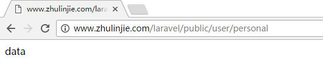

#轻松学会Laravel-基础篇

######Laravel 一键安装包下载：[http://www.golaravel.com/download/](http://www.golaravel.com/download/)

###路由参数
```
Route::get('user/{id}', function($id){
	return $id;
});
```
符合条件的路由：http://www.zhulinjie.com/laravel/public/user/1


```
Route::get('user/{name?}', function($name='zhangsan'){
	return $name;
});
```
不传参数访问： http://www.zhulinjie.com/laravel/public/user

  

传参数访问：http://www.zhulinjie.com/laravel/public/user/zhulinjie


```
Route::get('user/{name?}', function($name='zhangsan'){
	return $name;
})->where('name', '[A-Za-z]+');
```
符合条件的路由：http://www.zhulinjie.com/laravel/public/user/zhangsan

  

不符合条件的路由：http://www.zhulinjie.com/laravel/public/user/1


###别名路由
```
Route::get('user/user-personal', ['as'=>'personal', function(){
	return route('personal');
}]);
```
符合条件的路由：http://www.zhulinjie.com/laravel/public/user/zhangsan


###路由群组
```
Route::group(['prefix'=>'admin'], function(){
	Route::get('user/user-personal', ['as'=>'personal', function(){
		return route('personal');
	}]);
});
```
符合条件的路由：http://www.zhulinjie.com/laravel/public/admin/user/user-personal


###控制器
routes.php
```
Route::get('user/personal', [
	'uses' => 'PersonalController@index',
	'as' => 'personal'
]);
```
PersonalController.php
```
<?php

namespace App\Http\Controllers;

class PersonalController extends Controller
{
	public function index(){
		return route('personal');
	}
}
```


###模型
Personal.php
```
<?php

namespace App;

use Illuminate\Database\Eloquent\Model;

class Personal extends Model{
	public static function getAll(){
		return 'data';
	}
}
```
PersonalController.php
```
<?php

namespace App\Http\Controllers;

use App\Personal;

class PersonalController extends Controller
{
	public function index(){
		return Personal::getAll();
	}
}
```


###使用DB facade实现CURD
```
CREATE TABLE `student` (
  `id` int(10) unsigned NOT NULL AUTO_INCREMENT COMMENT '学生表',
  `name` varchar(255) NOT NULL DEFAULT '' COMMENT '姓名',
  `age` tinyint(3) unsigned NOT NULL DEFAULT '0' COMMENT '年龄',
  `sex` tinyint(3) unsigned NOT NULL DEFAULT '10' COMMENT '10 未知   20 男   30 女',
  `create_at` int(11) NOT NULL DEFAULT '0' COMMENT '新增时间',
  `update_at` int(11) NOT NULL DEFAULT '0' COMMENT '修改时间',
  PRIMARY KEY (`id`)
) ENGINE=InnoDB AUTO_INCREMENT=3 DEFAULT CHARSET=utf8;
```

routes.php
```
Route::get('student', [
	'uses' => 'StudentController@index',
	'as' => 'student'
]);
```
StudentController.php
```
<?php

namespace App\Http\Controllers;

use Illuminate\Support\Facades\DB;

class StudentController extends Controller
{
	public function index(){
		// 新增
		// $bool = DB::insert('insert into student(name, age) values(?, ?)', ['lisi', 25]);
		// var_dump($bool);
		
		// 更新
		// $num = DB::update('update student set age = ? where name = ?', [20, 'zhangsan']);
		// 返回影响的行数
		// var_dump($num);		

		// 删除
		// $num = DB::delete('delete from student where id > ?', [1]);
		// 返回影响的行数
		// var_dump($num);
		
		// 查询
		$data = DB::select('select * from student where id >= ?', [1]);
		dd($data);
	}
}
```


###查询构造器新增数据
```
<?php

namespace App\Http\Controllers;

use Illuminate\Support\Facades\DB;

class StudentController extends Controller
{
	public function index(){
		// 新增一条数据
		// $bool = DB::table('student')->insert(['name'=>'zhangsan', 'age'=>18]);
		// var_dump($bool);
		
		// 新增一条数据并获取自增ID
		// $id = DB::table('student')->insertGetId(['name'=>'lishi', 'age'=>20]);
		// var_dump($id);
		
		// 新增多条数据
		$bool = DB::table('student')->insert([
			['name'=>'wangwu', 'age'=>25],
			['name'=>'zhaoliu', 'age'=>22]
		]);
		var_dump($bool);
	}
}
```

###查询构造器更新数据
```
<?php

namespace App\Http\Controllers;

use Illuminate\Support\Facades\DB;

class StudentController extends Controller
{
	public function index(){
		// 更新 返回受影响的行数
		// $num = DB::table('student')->where('id', 4)->update(['age'=>30]);
		// var_dump($num);
		
		// 自增1
		// $num = DB::table('student')->where('id', 4)->increment('age'); 
		// var_dump($num);

		// 自增3
		// $num = DB::table('student')->where('id', 4)->increment('age', 3);
		// var_dump($num);

		// 自减1
		// $num = DB::table('student')->where('id', 4)->decrement('age');
		// var_dump($num);
		
		// 自减3
		// $num = DB::table('student')->where('id', 4)->decrement('age', 3);
		// var_dump($num);

		// 自增3 同时将name改为zhulinjie
		$num = DB::table('student')->where('id', 4)->increment('age', 3, ['name'=>'zhulinjie']);
		var_dump($num);
	}
}
```

###查询构造器删除数据
```
<?php

namespace App\Http\Controllers;

use Illuminate\Support\Facades\DB;

class StudentController extends Controller
{
	public function index(){
		// 删除id大于6的记录 返回影响记录行数
		// $num = DB::table('student')->where('id', '>', 6)->delete();
		// var_dump($num);

		// 清空数据 不返回任何数据
		DB::table('student')->truncate();
	}
}
```

###查询构造器查询数据
```
<?php

namespace App\Http\Controllers;

use Illuminate\Support\Facades\DB;

class StudentController extends Controller
{
	public function index(){
		// get() 获取多条记录
		// $students = DB::table('student')->get();
		// dd($students);

		// first() 获取结果集中的第一条记录
		// $student = DB::table('student')->first();
		// dd($student);
		
		// where() 
		// $students = DB::table('student')->where('id', '>=', 2)->get();
		// dd($students);
		
		// whereRaw() 多条件查询
		// $students = DB::table('student')->whereRaw('id >= ? and id <= ?', [2,3])->get();
		// dd($students);
		
		// $students = DB::table('student')->whereRaw('id >= ? or age = ?', [3, 18])->get();
		// dd($students);
		
		// pluck() 从数据表中取得单一数据列
		// $names = DB::table('student')->pluck('name');
		// dd($names);

		// lists() 也可以获取单一数据列，但lists的第二个参数可以将某个字段当前键返回
		// $names = DB::table('student')->lists('name');
		// dd($names);

		// $students = DB::table('student')->lists('age', 'name');
		// dd($students);
		
		// select() 指定查询字段
		// $students = DB::table('student')->select('name', 'age')->get();
		// dd($students);

		// chunk() 拆分查询 备注：现在并不明白是什么意思和具体的使用场景
		// echo '<pre>';
		// DB::table('student')->chunk(3, function($students){
		// 	print_r($students);
		// });
		
		echo '<pre>';
		DB::table('student')->chunk(3, function($students){
			print_r($students);

			return false;
		});
	}
}
```
pluck() 方法浏览器中运行效果：


lists() 方法浏览器中运行效果：


chunk() 方法浏览器中运行效果：


chunk() 方法浏览器中运行效果：


###查询构造器中的聚合函数
```
<?php

namespace App\Http\Controllers;

use Illuminate\Support\Facades\DB;

class StudentController extends Controller
{
	public function index(){
		// $num = DB::table('student')->count();
		// var_dump($num);
		
		// $max = DB::table('student')->max('age');
		// var_dump($max);
		
		// $min = DB::table('student')->min('age');
		// var_dump($min);

		// $avg = DB::table('student')->avg('age');
		// var_dump($avg);
		
		$sum = DB::table('student')->sum('age');
		var_dump($sum);
	}
}
```

###ORM简介、模型的建立及查询数据
Student.php
```
<?php

namespace App;

use Illuminate\Database\Eloquent\Model;

class Student extends Model{
	// 指定表名
	protected $table = 'student';			// 默认对应的是students表

	// 指定主键
	// protected $primaryKey = 'id';		// 默认主键就是ID
}
```

StudentController.php
```
<?php

namespace App\Http\Controllers;

use App\Student;

use Illuminate\Support\Facades\DB;

class StudentController extends Controller
{
	public function index(){
		// $students = Student::all();
		// dd($students);
		
		// 获取id为1的记录，如果记录不存在，返回null
		// $student = Student::find(1);
		// dd($student);
		
		// 获取id为11的记录，如果记录不存在，会报错
		// $student = Student::findOrFail(1);
		// dd($student);
		
		// 查询构造器在ORM中的应用
		// $students = Student::get();
		// dd($students);
		
		// $student = Student::where('id', 1)->first();
		// dd($student);
		
		// echo '<pre>';
		// Student::chunk(3, function($students){
		// 	print_r($students);
		// });
		
		// 查询构造器中的聚合函数在ORM中的应用
		// $num = Student::count();
		// dd($num);
		
		$max = Student::where('id', '>', 1)->max('age');
		dd($max);
	}
}
```